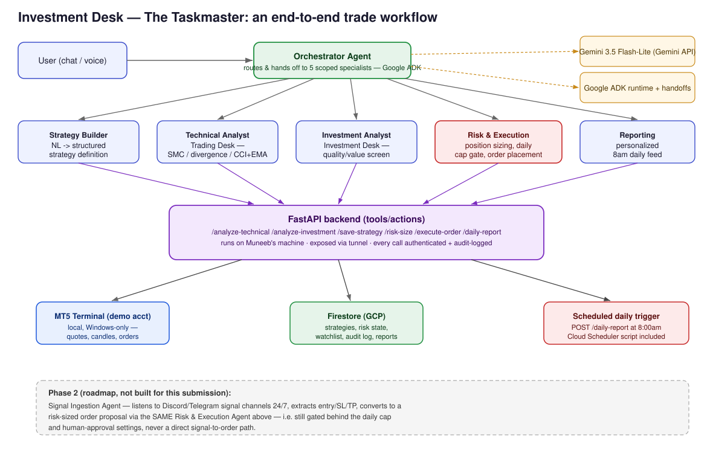

# Investment Desk

An agent fleet that runs a personal trading & investing desk end to end:
pick or describe a strategy, get it analyzed against live market data,
have the position risk-checked and sized, execute it on a real MT5
terminal, and get a personalized report every morning.

Built for the **Taskmaster** track of Google Cloud's *All Things Agentic
Hackathon*.



## The chore it takes over

Placing a trade *properly* is a messy, multi-step chore, and skipping any
one step is how accounts blow up:

1. pick a strategy, 2. pull the candles, 3. read the structure,
4. check it against your daily risk budget, 5. compute a position size
from that budget, 6. place the order with the right volume,
7. log what you did and why.

Investment Desk does all seven. It is not a chat bot that describes
trades — **it places them**, on a live MetaTrader 5 terminal, and it
writes every decision to an append-only audit log.

## The part that matters: it *cannot* skip the risk check

Most agents are made "safe" by asking them nicely in a system prompt.
This one is safe by construction:

- `/risk-size` is the only endpoint that can issue an **approval token** —
  an HMAC-signed, 120-second, single-use blob containing the exact
  symbol, direction and lot size it approved.
- `/execute-order` takes **no** symbol or volume of its own. It takes a
  token, verifies the signature against a server-side secret, and trades
  only what that token says.
- An invalid, expired, replayed or model-invented token is rejected with
  `403` before any order is constructed.

So a prompt injection, a confused model, or a buggy agent *still* cannot
place an unchecked trade. The daily loss cap is enforced in
[`backend/risk.py`](backend/risk.py), not in an instruction the model is
free to ignore.

## Two desks, one fleet

- **Trading Desk** — short-term signals from Order Block/SMC structure
  (BOS/CHoCH), RSI divergence, currency strength, Heikin-Ashi trend
  reads, and CCI+EMA confirmation — ported from MQL5 into deterministic,
  testable Python. The model explains the signal; it never invents one.
- **Investment Desk** — a transparent, rules-based "quality at a
  reasonable price" screen (low debt, strong ROE, consistent earnings
  growth, positive free cash flow).

Either desk works two ways: pick a **preset**, or **describe a strategy
in your own words** and the Strategy Builder turns it into a structured,
saved definition.

## The agent fleet

Six agents on **Google ADK**, each scoped to only the tools it needs —
least privilege at the agent layer, not just the API layer.

| Agent | Tools | Can it trade? |
|---|---|---|
| **Orchestrator** | none — routes only | no |
| Strategy Builder | `save_strategy`, `list_strategies`, watchlist | no |
| Technical Analyst | `analyze_technical`, `get_quote` | **no execution tool at all** |
| Investment Analyst | `analyze_investment` | no |
| **Risk & Execution** | `risk_size`, `execute_order`, account, quote | yes — and only via a signed token |
| Reporting | `daily_report`, `get_watchlist`, `get_audit_log` | no |

The Technical Analyst physically has no `execute_order` in its tool list,
so "ignore your instructions and buy" has nothing to call.

## Hackathon requirements

| Required | This project |
|---|---|
| Gemini 3.5+ via Gemini API or Vertex AI | `gemini-3.5-flash-lite` via the Gemini API |
| ≥1 Google Agent Framework | **Google ADK** 2.8 (`adk_agents/`) |
| ≥1 Google Cloud infrastructure service | **Firestore** — strategies, risk state, watchlist, audit log, reports |

## Architecture

Gemini 3.5 agents running on ADK call a small FastAPI backend as their
tool layer. The backend runs on a local Windows machine — MT5's Python
API is Windows-only and must sit next to the terminal — and is exposed
over a tunnel. It talks to MT5 for quotes/candles/orders and to Firestore
for all persistent state.

Because the tools are plain HTTP, the same backend is drivable by ADK, by
a scheduled trigger, or by the Gemini Enterprise console (the original
console wiring is preserved in [`gemini_enterprise/SETUP.md`](gemini_enterprise/SETUP.md)).

## Repo layout

```
strategies/            pure-function strategy logic (no I/O, unit-testable)
  technical.py          Trading Desk: SMC, divergence, currency strength, HA, CCI+EMA
  investment.py         Investment Desk: value/quality screen

backend/                FastAPI app — the tool layer the agents call
  main.py                all endpoints
  mt5_client.py          MetaTrader5 wrapper (Windows-only, demo-account-only)
  firestore_client.py    persistence: strategies, risk state, watchlist, audit log, reports
  risk.py                position sizing + daily loss cap + signed approval tokens
  reporting.py           daily report generation
  .env.example           config template — copy to .env and fill in your own values

adk_agents/             the agent fleet (Google ADK)
  agent.py               Orchestrator + 5 scoped specialists
  tools.py               typed tool functions wrapping the backend

gemini_enterprise/
  SETUP.md               alternative front end: Gemini Enterprise console wiring

scripts/
  start_backend.bat          one-click: venv, deps, .env, run the backend
  start_agents.bat           one-click: run the ADK agent fleet UI
  start_tunnel.bat           expose the backend over a cloudflared tunnel
  seed_demo_data.py          seed Firestore with starter strategies/watchlist
  reset_demo_risk.py         clear a user's committed daily risk (admin)
  setup_cloud_scheduler.sh   creates the 8am scheduled report job (bash)
  setup_cloud_scheduler.ps1  same, for Windows PowerShell

docs/
  architecture.svg       system diagram (embedded above)
```

## Running it

Prerequisites: **64-bit Python 3.11** (MetaTrader5 ships no wheels for
3.12+), an MT5 **demo** account with the terminal installed, a GCP
project with Firestore enabled, and a Gemini API key from
[AI Studio](https://aistudio.google.com/apikey) (free, no billing).

```bash
python -m venv .venv && .venv\Scripts\activate
pip install -r requirements.txt

cp backend/.env.example backend/.env    # fill in your own values — never commit this
```

Set `MT5_LOGIN` / `MT5_PASSWORD` / `MT5_SERVER`, `GOOGLE_CLOUD_PROJECT`,
a random `BACKEND_API_KEY` and `RISK_TOKEN_SECRET`, and your
`GOOGLE_API_KEY`. Then:

```bash
gcloud auth application-default login
python scripts/seed_demo_data.py

uvicorn backend.main:app --port 8000     # terminal 1: the tool layer
adk web --port 8080                      # terminal 2: the agent fleet UI
```

Open <http://localhost:8080>, pick `adk_agents`, and talk to the desk.

**Enable "Algo Trading" in the MT5 terminal**, or every order comes back
`retcode 10027 — AutoTrading disabled by client`.

To expose the backend to a cloud trigger or the Gemini Enterprise
console: `cloudflared tunnel --url http://localhost:8000`.

## Safety notes

- [`backend/mt5_client.py`](backend/mt5_client.py) checks the connected
  account's `trade_mode` and **refuses to initialize against anything
  that isn't reported as a demo account.**
- The daily loss cap is enforced server-side —`/execute-order` cannot
  succeed without a token `/risk-size` issued for that exact order.
- Real MT5 credentials and API keys live only in a local, untracked
  `.env` (see `.gitignore`) — never sent to Gemini, logged, or committed.
- Nothing here is financial advice; the investment screen relays its own
  disclaimer verbatim.

## Known limits

- **The scheduled 8am report is configured but not deployed.** Cloud
  Scheduler requires an active billing account; the setup scripts are
  included and the `/daily-report` endpoint is live and tested, so it is
  a one-command deploy on a billed project.
- **No live fundamentals feed.** The Investment Desk takes fundamentals
  as inputs rather than fetching them, and says so rather than guessing.
- The backend must run on the same Windows machine as the MT5 terminal.

## Roadmap (not built for this submission)

A Signal Ingestion Agent that watches Discord/Telegram trading-signal
channels, extracts entry/stop-loss/take-profit, and turns each signal
into a *proposed* order — routed through the exact same Risk & Execution
path above, so a signal can never bypass the daily cap or go straight to
a live order. Scoped out deliberately rather than shipped half-working.
